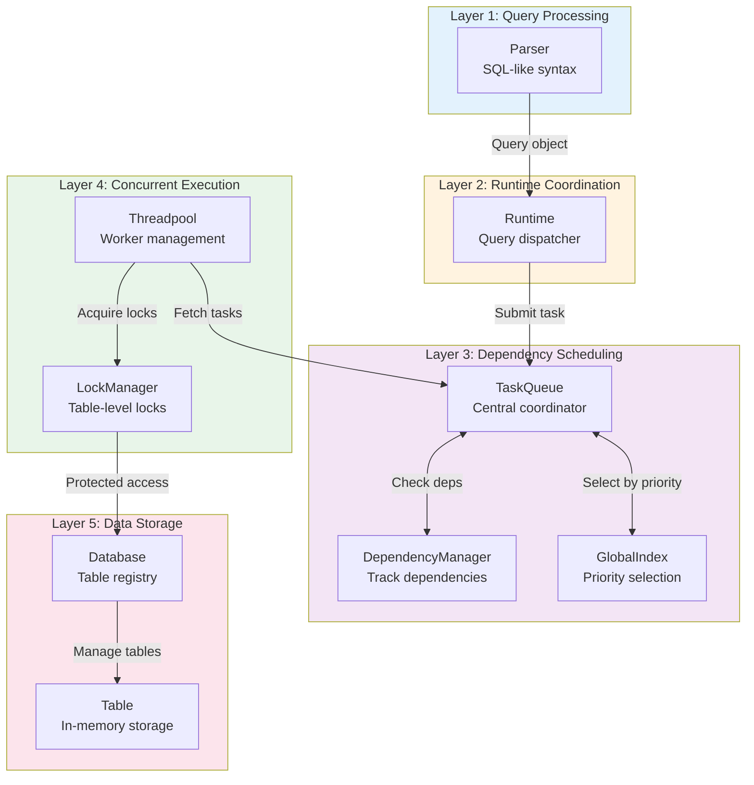

# LemonDB - Multi-Threaded In-Memory Database

[](LICENSE)
[](https://en.cppreference.com/w/cpp/20)


A high-performance, multi-threaded in-memory relational database with dependency-aware task scheduling, designed to achieve near-linear scalability for concurrent query execution.

## Overview

LemonDB is a C++20-based in-memory database that transforms single-threaded query execution into a highly concurrent system. The system employs a layered architecture with:

- **Dependency-aware scheduler**: Automatically resolves file and table dependencies
- **Pull-based thread pool**: Workers autonomously fetch tasks with batch optimization
- **Readers-writer locks**: Enables concurrent reads while serializing writes
- **Zero-overhead abstractions**: Scheduler little overhead of total execution time

## Architecture

LemonDB employs a 5-layer architecture with data flowing from queries to storage:



## Project Structure

```
p2team03/
+-- src/
|   +-- main.cpp                 # Entry point
|   +-- db/                      # Database layer
|   |   +-- Database.{h,cpp}     # Table registry
|   |   +-- Table.{h,cpp}        # In-memory storage
|   +-- query/                   # Query layer
|   |   +-- Query*.{h,cpp}       # Query execution
|   |   +-- data/                # Data query implementations
|   +-- runtime/                 # Runtime coordination
|   |   +-- Runtime.{h,cpp}      # Main runtime
|   |   +-- LockManager.*        # Concurrency control
|   |   +-- Threadpool.*         # Worker management
|   +-- scheduler/               # Dependency scheduling
|   |   +-- TaskQueue.*          # Central coordinator
|   |   +-- DependencyManager.*  # Dependency tracking
|   |   +-- GlobalIndex.*        # Priority selection
|   +-- utils/                   # Utilities
+-- test/                        # Test queries and data
+-- tools/                       # Build and analysis tools
+-- CMakeLists.txt               # Build configuration
```

## Installation

### Prerequisites

- `Clang++-18`
- CMake 3.22+
- Git

### Build Instructions

1. **Clone the project**:

   ```bash
   git clone ssh://git@focs.ji.sjtu.edu.cn:2222/ece482/p2team03.git
   cd p2team03
   ```

2. **Build the project**:

   ```bash
   tools/compile
   ```

   This creates multiple build variants:

   - `build/lemondb` - Release build (optimized)
   - `build/lemondb-asan` - AddressSanitizer (memory errors)
   - `build/lemondb-ubsan` - UndefinedBehaviorSanitizer (UB detection)
   - `build/lemondb-msan` - MemorySanitizer (uninitialized memory)

3. **Run lemondb**:

   ```bash
   build/lemondb --listen <query_file> --threads=<N>
   ```

   Options:

   - `--listen <file>` or `-l <file>`: Input file with queries
   - `--threads <N>` or `-t <N>`: Number of worker threads (0 = auto-detect)

### Clean Build

To remove all compiled files:

```bash
rm -rf build
```

## Usage

### Basic Example

```bash
# Run with 8 worker threads
build/lemondb --listen test/queries/basic.query --threads=8

# Auto-detect thread count
build/lemondb --listen test/queries/basic.query --threads=0

# Single-threaded mode
build/lemondb --listen test/queries/basic.query --threads=1
```

### Query Format

LemonDB supports standard SQL-like queries:

```sql
-- Table operations
LOAD students.query;
INSERT ( Alice 25 30000 ) FROM Students ;
SELECT ( KEY Age ) FROM students WHERE ( Age > 20 );
UPDATE ( Age 20 ) FROM Student WHERE ( KEY = Alice );
DELETE ( ) FROM Students WHERE ( Age < 18 );
DUMP Students students.back;
DROP Students;

-- Aggregation
COUNT ( ) FROM Students WHERE ( Age > 25 );
SUM ( Salary Grade ) FROM Students;
MIN ( Age ) FROM Students;
MAX ( Salary ) FROM students WHERE ( Age < 25 );

-- Utility
LISTEN undergraduates.query;
LIST;  -- Only allowed in DEBUG mode. Show all tables
QUIT;  -- Exit (waits for all tasks)
```

## Documentation

Comprehensive documentation available in the [***project wiki***](https://focs.ji.sjtu.edu.cn/git/ece482/p2team03/wiki):

### Architecture Documentation

- ***[System Architecture](https://focs.ji.sjtu.edu.cn/git/ece482/p2team03/wiki/%5BDoc%5D-LemonDB-System-Architecture)*** - Complete system overview with design principles, performance analysis, and multi-threading challenges
- ***[Database Layer](https://focs.ji.sjtu.edu.cn/git/ece482/p2team03/wiki/%5BDoc%5D-Database-Layer-Architecture)*** - In-memory storage structures and dual-index design
- ***[Query Layer](https://focs.ji.sjtu.edu.cn/git/ece482/p2team03/wiki/%5BDoc%5D-Query-Layer-Architecture)*** - Query parsing and execution logic
- ***[Scheduler](https://focs.ji.sjtu.edu.cn/git/ece482/p2team03/wiki/%5BDoc%5D-Scheduler-Architecture)*** - Dependency-aware task orchestration
- ***[Lock Manager](https://focs.ji.sjtu.edu.cn/git/ece482/p2team03/wiki/%5BDoc%5D-Lock-Manager-Architecture)*** - Readers-writer concurrency control
- ***[Thread Pool](https://focs.ji.sjtu.edu.cn/git/ece482/p2team03/wiki/%5BDoc%5D-Thread-Pool-Architecture)*** - Worker thread management

### Development Documentation

- ***[Development Guidelines](https://focs.ji.sjtu.edu.cn/git/ece482/p2team03/wiki/%5BDev%5D-Guidelines)*** - Coding standards and best practices
- ***[Risk Assessment](https://focs.ji.sjtu.edu.cn/git/ece482/p2team03/wiki/%5BDev%5D-Risk-Assessment)*** - Known issues and mitigation strategies
- ***[Roadmap](https://focs.ji.sjtu.edu.cn/git/ece482/p2team03/wiki/%5BDev%5D-Roadmap)*** - Development timeline and future enhancements

## Known Limitations

1. **Hot Table Bottleneck**: Write-heavy workloads on a single table serialize execution
2. **Version Accumulation**: Frequent priority updates can accumulate stale heap entries
3. **Fixed Pool Size**: Thread pool cannot resize after initialization
4. **Memory-Only Storage**: No persistence (data lost on exit)

## Authors

**p2team03**

- Jiang Ruiyu
- Yao Yunxiang
- Zheng Letian
- Zuo Tianyou

## License

This project is licensed under the MIT License - see the [LICENSE](LICENSE) file for details.
